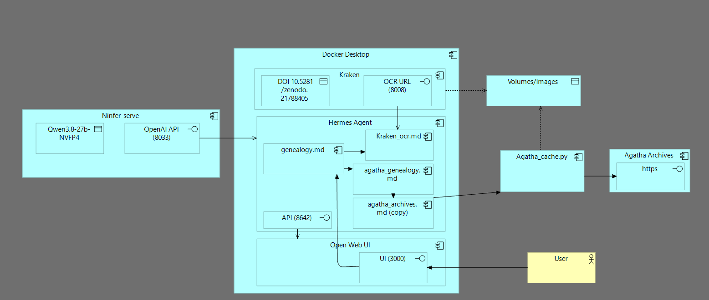

# Gen-Agent (how to build your own Genealogy agentic tool-

This repository purpose is not to be used as-such but as an example of how to build/use agentic skills for genealogy research.

As such, it's only useful if you do birth research on Belgian Pre-1796 archives on Agatha (The online search environment of the State Archives of Belgium).

However it can alsobe used as a proven example and starting point for building your own specific skills (ie: if you're looking for example in Italian, French archives, etc..). if you do so, please leave some comments, that will make my day ;)
The following instructions aims to help you build your own tool using this as a base.

To implement and run this you need :
- 1. a LLM, could be local (I ran this with qwen3.8-27b-nvfp4.ninfer) or external (probably anything above Flash models would be ok)
  As a matter of reference, for a 10h run on 8K pages, token consumption was 2m output and 75m input.
- 2. an agentic framework, I used hermes_agent, which delivered beautifully.
- 3. an ocr tool (it is a case where LLM vision towers dramatically fails vs standard trained OCR), I definitely recommend Kraken, as it allows to use a myriad OCR models and the best results would be with a model trained on data most related to the archives you're using.
  For reference, for the archives of Antwerpen parish, I used DOI 10.5281/zenodo.21788405 (small) which is trained on old Latin Script. I tried also the medium size, but accuracy was not much improved with a much slower speed.
- 4. local genealogy archives or a digital access to those archives
- 5. instructions to the agentic framework

We will consider you already have point 1 and 2 operational.

Let's build 3 together

Kraken is best implemented as a docker service, you will find the docker compose, requirements, etc.. in the Kraken directory, but as you have an agentic framework, just ask it to install it for you or give you the instructions to do it for your environment.
I used this Kraken model : https://zenodo.org/records/21788405 for OCR but you can also give your LLM sample of your archive and recommend a specific Kraken compatible OCR model
Make sure you test the OCR works (your agentic framework will give you the instructions)
Ask your agent to build a skill to access the OCR you just implemented (it can inspire/reuse from the one in the repository)

Let's build 4 together 

Imagine there's a digital archive you can access with the documents for a given location and period (aka Antwerpen/St Joris Parish/Birth 1772-1792).
Give the base url to the agent and asks him to retrieve a small part of a specific document, the agent will tries different methods until it has it covered.
One done, ask to build a cache system for this retrievals so a document is never retrieved more than once, the data being immutable.
Test it
If you have different kind of documents (Indexes, Registers, etc..) or different way of accesses, make the agent build those as well.
Ask your agent to build a skill to access the Archives with what's just been implemented (it can inspire from the one in the repository but it should be your agentic code running)

Let's build 5 together

Starting with the existing genealogy skill in this repo, ask your agent to search for a specific birth, death, etc.. that you know already.
You will probably need a few iterations for it to run well unattended on that task, do not forget to make him update the skill
Then ask him to search for a specific birth, etc.. that you know do NOT exists, it will help stabilize the alternative strategies (update the skill).
Once done, you can start the real tasks, ask him to make a plan to search for a person/date/location.
Review the plan, you probably need a few iterations
Ask him to assess the run time and data needed (you probably don't want to run it if 1Mio images download are needed..)
If all is ok, ask to run the plan unattended ;)

The repositery  structure is as follows :
- A genealogy skill, explaining how to do genealogy.
- An agatha_genealogy skill, used to retrieve and cache data from the state archives (caching is important, you don't want to ddos a public service) [the subskill agatha_archives is used by this one].
- An ocr skill, used to extract txt from the retrieved images, based on Kraken.
- The Kraken docker configuration.

See here for a more detailed technical architecture

